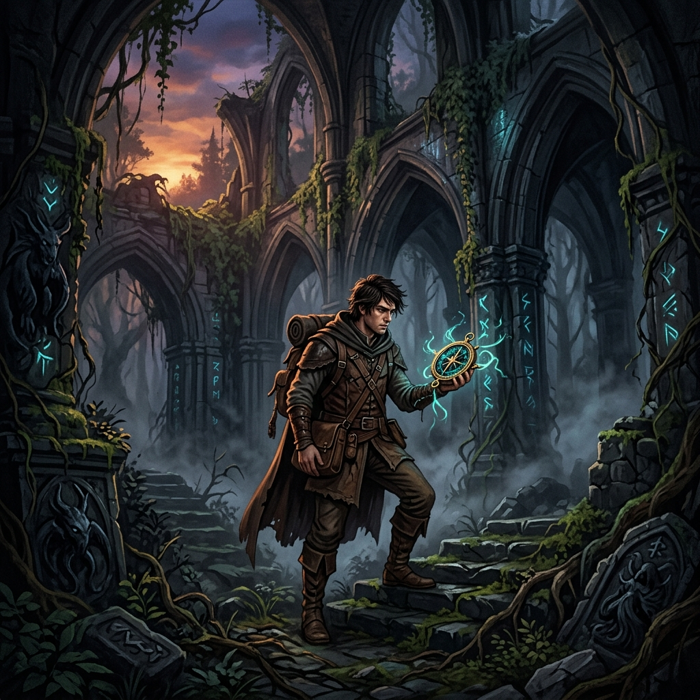
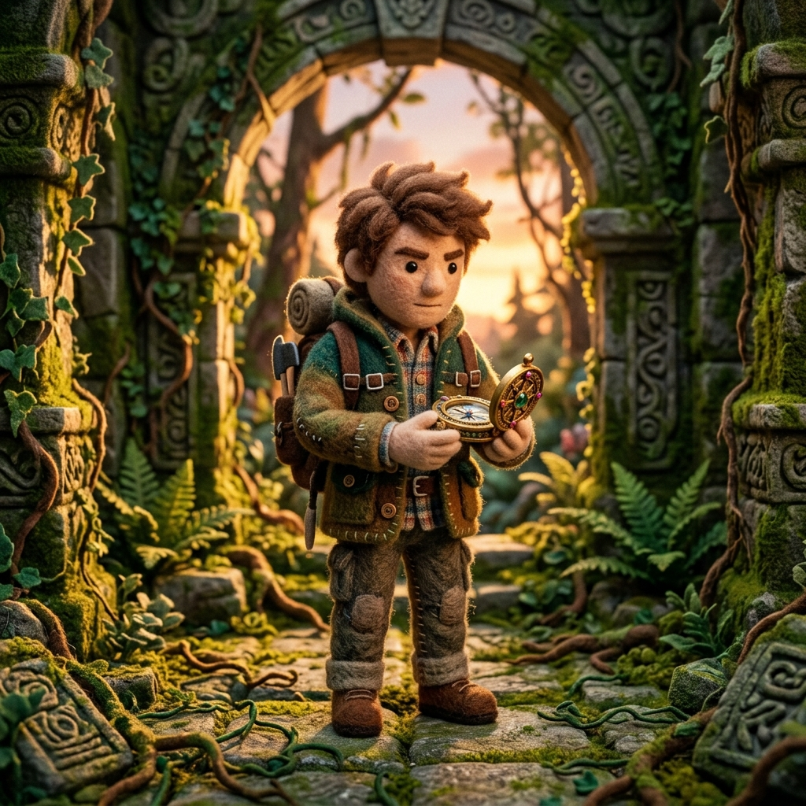
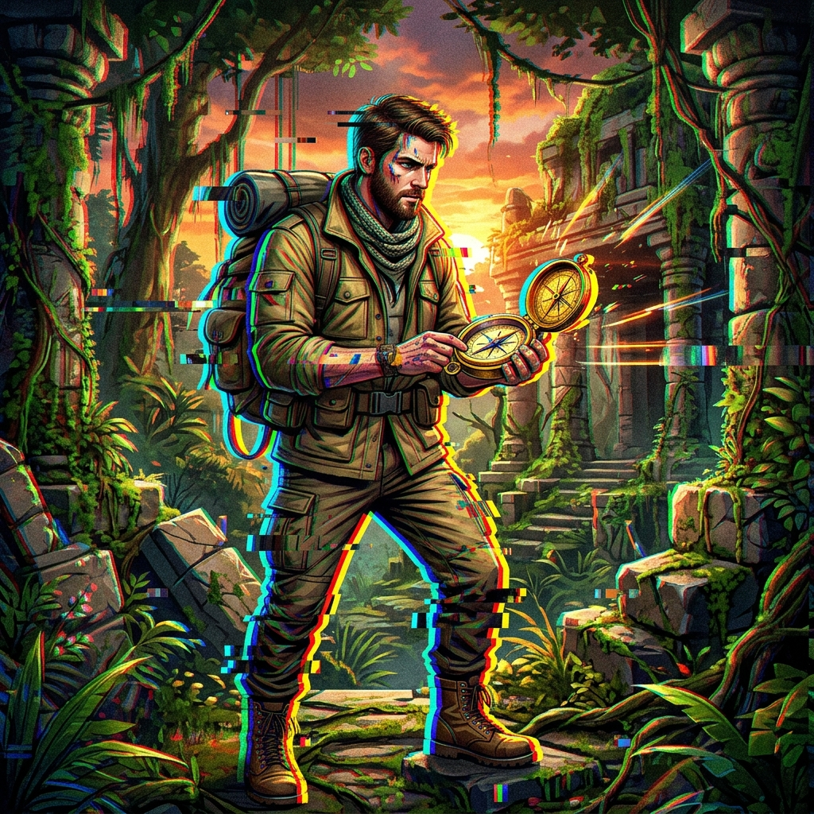
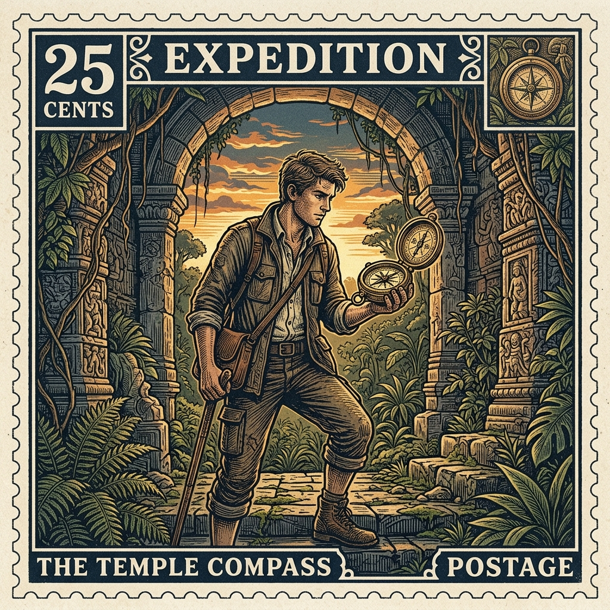
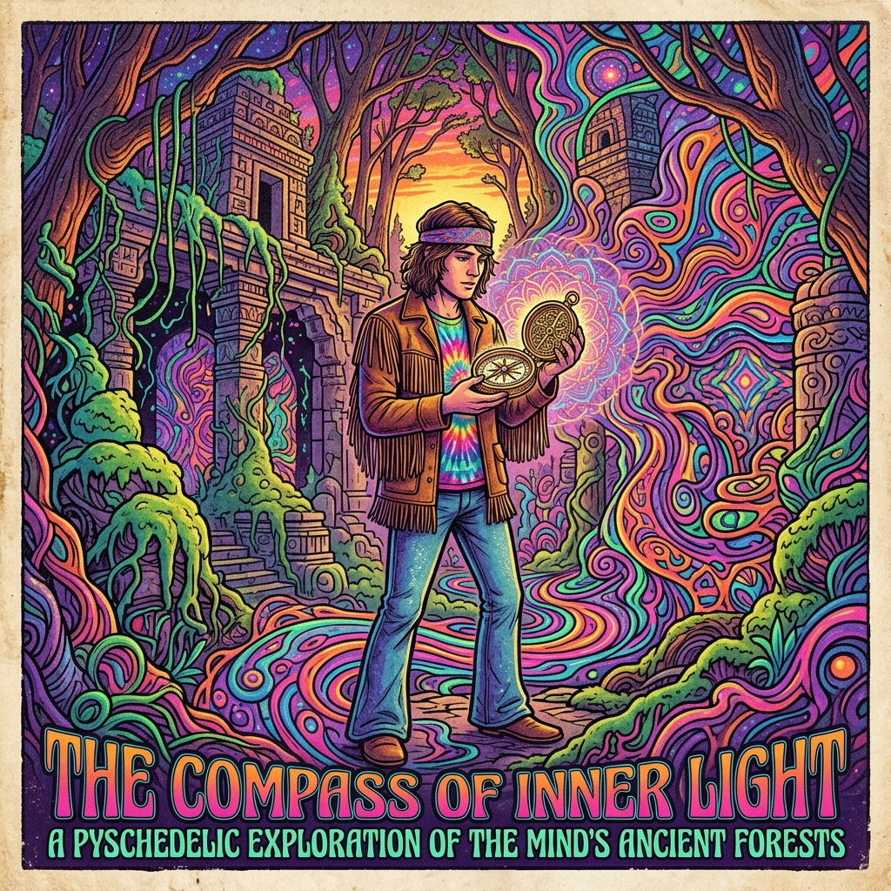

# 🎨 Script Pro Style Presets & Image Repository (`script-style-image`)

[](styles.json)
[](styles.json)

Public repository hosting dynamic style preset configurations (`styles.json`) and preview benchmark images for the Script Pro web application.

---

## 📌 Benchmark Story & Raw Prompt

To maintain visual consistency and comparability across all artistic style presets, all preview images use **1 single benchmark story**:

- **Shot Raw Prompt**:
  > `brave young man explorer holding an ancient ornate golden compass inside an ancient overgrown forest temple, sunset lighting`

---

## 🖼️ Style Presets Catalogue

| # | Style Key | Style Name | Description | Image Preview |
| :-: | :--- | :--- | :--- | :--- |
| **1** | `hand-drawn-stickman` | **Hand-drawn Stickman** | Hand-drawn sketch colored with pencils, featuring imperfect sketchy outlines and realistic coloring textures. |  |
| **2** | `watercolor` | **Watercolor Painting** | Soft washed watercolor, wet-on-wet texturing, and ink splatters. |  |
| **3** | `pixel-art` | **Retro Pixel Art** | 16-bit arcade video game aesthetic with vibrant limited color palettes. |  |
| **4** | `cyberpunk` | **Cyberpunk Glow** | Neon lighting, dark synthwave tones, and high-tech details. |  |
| **5** | `realistic-3d` | **Realistic 3D Render** | Photorealistic octane render details with cinematic studio lighting. |  |
| **6** | `pencil-sketch` | **Graphite Pencil Sketch** | Hand-drawn graphite pencil drawing, fine lines, textured pencil shading, and paper grain. |  |
| **7** | `gothic-oil-painting` | **Renaissance Oil Painting** | Dark renaissance oil painting, visible canvas texture, heavy brush strokes, and dramatic lighting. |  |
| **8** | `claymation-3d` | **Claymation 3D** | Stop-motion plasticine clay model style with fingerprint textures and soft clay materials. |  |
| **9** | `origami-papercraft` | **Origami Papercraft** | Folded paper shapes, layered paper cutouts, realistic paper textures, and drop shadows. |  |
| **10** | `neon-glow-blueprint` | **Neon Blueprint** | Technical schematic blueprint style with glowing grid lines and technical designs. |  |
| **11** | `comic-pop-art` | **Retro Pop Art** | Vintage comic book pop-art style with halftone dots, thick ink outlines, and retro color print aesthetic. |  |
| **12** | `isometric-voxel` | **Isometric Voxel** | 3D blocky voxel art style, isometric view angle, retro cubic pixel structures. |  |
| **13** | `vintage-ink-watercolor` | **Ink & Wash Storybook** | Classic children's storybook style, fine ink outlines, and light watercolor washes. |  |
| **14** | `crayon-child-drawing` | **Crayon Doodle** | Childlike colorful wax crayon drawings, thick texture strokes, and paper background. |  |
| **15** | `retro-futuristic-retrowave` | **80s Retrowave** | 80s outrun synthwave style, neon purple wireframe grid landscape, and glowing sun. |  |
| **16** | `anime-cel-shading` | **Anime Cel Shading** | Vibrant japanese anime style, clean lineart, soft cel shading, cinematic atmospheric lighting, Studio Ghibli & Shinkai inspired. |  |
| **17** | `steampunk-vintage` | **Victorian Steampunk** | 19th century industrial steampunk, brass gears, steam copper pipes, polished leather, and warm vintage sepia tones. |  |
| **18** | `stained-glass` | **Cathedral Stained Glass** | Gothic cathedral stained glass window style with glowing glass panels, dark lead metal outlines, and rich jewel colors. |  |
| **19** | `paper-cutout-3d` | **Layered Paper Cutout** | Multi-layered paper cutout art, 3D papercraft depth, soft volumetric shadows, clean pastel colors. |  |
| **20** | `cyberpunk-hologram` | **Digital Hologram Matrix** | Glowing cyan holographic projection, semi-transparent matrix glitch grid, digital scanlines, futuristic UI. |  |
| **21** | `chalkboard-sketch` | **Pastel Chalkboard Art** | White and pastel chalk drawings on dark dusty black chalkboard texture, hand-drawn educational art. |  |
| **22** | `chibi-kawaii-3d` | **Chibi Kawaii 3D** | Cute chibi proportions, large glossy eyes, soft pastel plastic toy materials, smooth 3D clay-toy render. |  |
| **23** | `noir-film-monochrome` | **1940s Noir Film** | High-contrast 1940s black & white film noir, dramatic Venetian blind shadows, moody atmospheric smoke and grain. |  |
| **24** | `stained-ink-tattoo` | **Japanese Sumi-e Ink** | Traditional Japanese Sumi-e brush ink strokes, fluid black ink washes, woodblock print texture, red stamp accent. |  |
| **25** | `low-poly-3d` | **Low Poly Fantasy** | Geometric faceted low-poly 3D models, clean sharp edges, vibrant gradient lighting, modern indie game aesthetic. |  |
| **26** | `gothic-dark-fantasy` | **Gothic Dark Fantasy** | Dark eldritch aesthetic, shadowy cathedral architecture, glowing rune accents, atmospheric fog, and dark fantasy tones. |  |
| **27** | `felt-plush-stopmotion` | **Felt Plush Toy** | Handcrafted wool felt textures, soft stitched fabric seams, miniature plush toy aesthetic, stop-motion animation feel. |  |
| **28** | `glitch-cyber-art` | **Digital Glitch Art** | Chromatic aberration distortion, digital pixel sorting, RGB color shifts, high-tech cyber glitch aesthetic. |  |
| **29** | `vintage-postage-stamp` | **Vintage Postage Stamp** | Engraved linocut print illustration, fine cross-hatching, retro 1950s postal stamp aesthetic, muted vintage ink colors. |  |
| **30** | `psychedelic-trippy-art` | **Psychedelic Vision** | Vibrant swirling neon liquid colors, kaleidoscopic patterns, 1960s psychedelic art, surreal dreamscape aesthetics. |  |

---

## 📁 Directory Structure

```text
script-style-image/
├── styles.json                        # Main preset configuration JSON (30 presets with order index)
├── README.md                          # Style previews & benchmark guide
└── images/                            # Preview images (1:1 format)
    ├── anime-cel-shading/
    ├── chalkboard-sketch/
    ├── chibi-kawaii-3d/
    ├── claymation-3d/
    ├── comic-pop-art/
    ├── crayon-child-drawing/
    ├── cyberpunk/
    ├── cyberpunk-hologram/
    ├── felt-plush-stopmotion/
    ├── glitch-cyber-art/
    ├── gothic-dark-fantasy/
    ├── gothic-oil-painting/
    ├── hand-drawn-stickman/
    ├── isometric-voxel/
    ├── low-poly-3d/
    ├── neon-glow-blueprint/
    ├── noir-film-monochrome/
    ├── origami-papercraft/
    ├── paper-cutout-3d/
    ├── pencil-sketch/
    ├── pixel-art/
    ├── psychedelic-trippy-art/
    ├── realistic-3d/
    ├── retro-futuristic-retrowave/
    ├── stained-glass/
    ├── stained-ink-tattoo/
    ├── steampunk-vintage/
    ├── vintage-ink-watercolor/
    ├── vintage-postage-stamp/
    └── watercolor/
```
